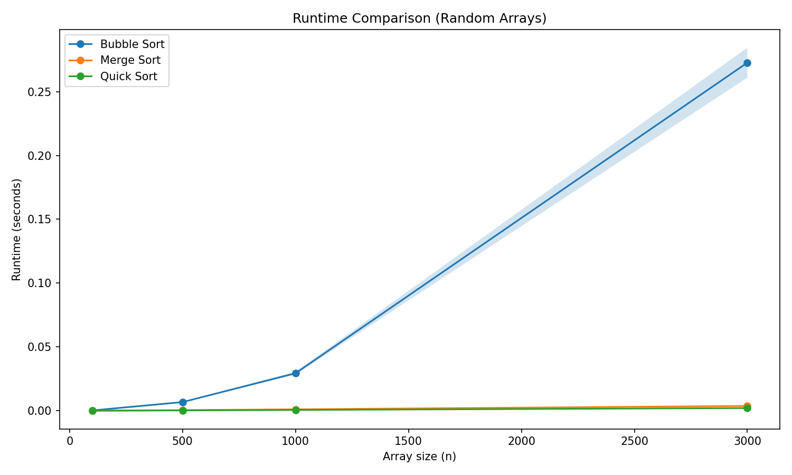
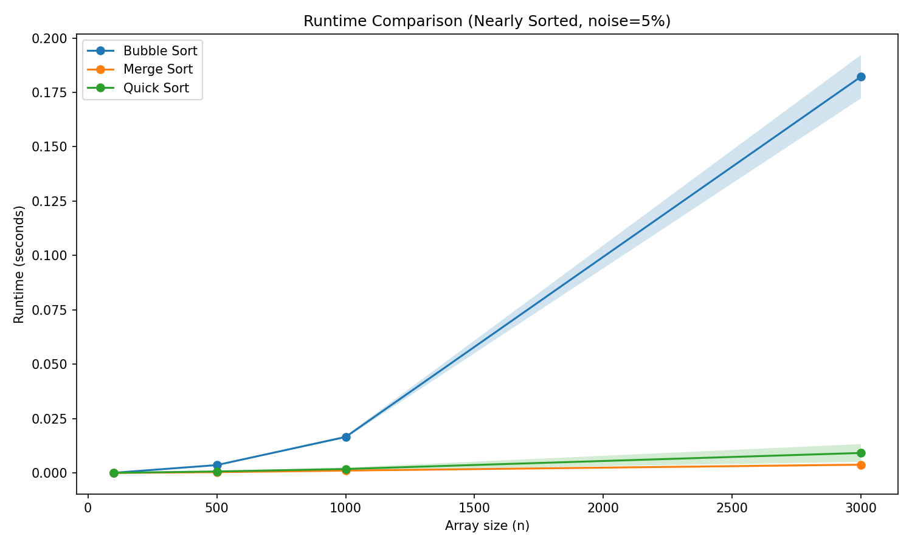

# Sorting Assignment

**Data Structures – Python Assignment 1, Spring 2026**

## Student Name(s)

- Itamar Bahat 205805856
- name of the other student. 

## Selected Algorithms

| ID | Algorithm |
|----|-----------|
| 1  | Bubble Sort |
| 4  | Merge Sort |
| 5  | Quick Sort |

## How to Run

```bash
# Install dependencies (only needed once)
pip install matplotlib numpy

# Example: compare algorithms 1, 2, 5 on sizes 100–3000, noise type 1 (5%), 20 reps
python run_experiments.py -a 1 4 5 -s 100 500 1000 3000 -e 1 -r 10
```

### Command-line arguments

| Flag | Description |
|------|-------------|
| `-a` | Algorithm IDs (1=Bubble, 2=Selection, 3=Insertion, 4=Merge, 5=Quick) |
| `-s` | Array sizes to test |
| `-e` | Experiment type: `1` = 5% noise, `2` = 20% noise |
| `-r` | Number of repetitions per (algorithm, size) pair |

## Results

### result1.png – Random Arrays



Bubble Sort is clearly the slowest algorithm. Its runtime grows quadratically (O(n²)), reaching ~0.27 seconds at n=3000, while Merge Sort and Quick Sort remain nearly flat and close to zero throughout. This matches their theoretical O(n log n) complexity, which grows much more slowly than O(n²). The shaded band around Bubble Sort widens at larger sizes, reflecting greater run-to-run variance as the algorithm takes longer.

### result2.png – Nearly Sorted Arrays (5% noise)



On nearly sorted input, Bubble Sort improves noticeably compared to result1 (~0.18s vs ~0.27s at n=3000), because fewer swaps are needed when most elements are already in order. Merge Sort and Quick Sort remain fast and are essentially unchanged — their O(n log n) performance is not sensitive to the initial order of elements at this noise level. The overall ranking of the three algorithms stays the same, confirming that Merge Sort and Quick Sort are consistently superior to Bubble Sort regardless of input order.
